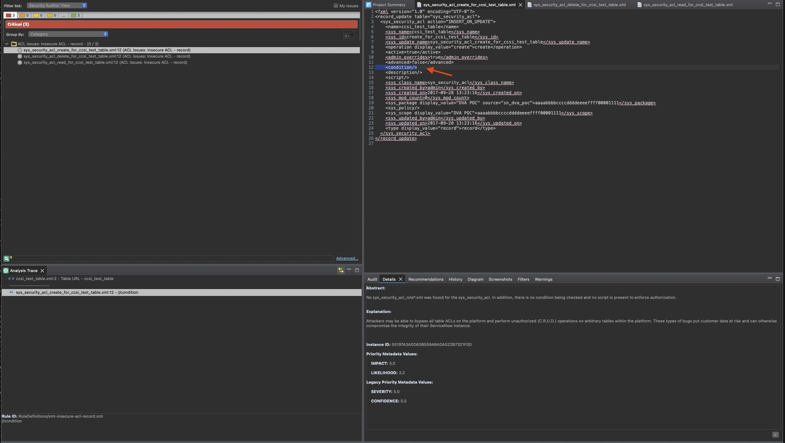

# App DVA Insecure ACLs
Typically ServiceNow scoped apps will simply include `.xml` files.  However, we have performed pre-processing on these `.xml` files where **CDATA** (Character Data) element exists.  The contents of CDATA includes TS/JS code embedded within.  The file extensions with `.0.snjs` contain the TS/JS code that was parsed from **CDATA**.

Additionally, we have provided transformed `.xml` files to `.0.js`.  We have found some static analysis products have greater reliability and  accuracy when the **xml** assignments are converted to a **javascript** syntax for semantics.  An example of the three (3) file types discussed are as follows:

* `sys_script_include_nonpublic_aclprotected.xml`
* `sys_script_include_nonpublic_aclprotected.xml.0.js`
* `sys_script_include_nonpublic_aclprotected.xml.0.snjs`.


The vulnerability categories that are covered in this code base are, `Insecure ACL record`,  `Insecure Client Callable Script Include (CCSI) Attribute`, `Cross-Site Request Forgery (CSRF) via Glide Processor`, and `Insecure ACL on Glide Processor`.  It should be noted that the Fortify scan illustrated below yields several False Negatives (FN) and only three (3) were True Positives (TP) that were identified.

Below are the files in-scope for the tests.

```
MisMatchedACLProcessor.java
sys_script_include_nonpublic_aclprotected.xml    
sys_script_include_nonpublic_noacl.xml
sys_security_acl_create_for_ccsi_test_table.xml
sys_security_acl_read_for_ccsi_test_table.xml
sys_security_acl_read_role_for_ccsi_test_table.xml
sys_security_acl_write_for_ccsi_test_table.xml
sys_security_acl_write_for_ccsi_test_table.xml
sys_security_acl_write_for_ccsi_test_table.xml
sys_security_acl_write_for_ccsi_test_table.xml
sys_security_acl_write_role_for_ccsi_test_table.xml
sys_security_acl_write_role_for_ccsi_test_table.xml
sys_security_acl_write_role_for_ccsi_test_table.xml
```
# Tests

### Insecure ACL on Glide Processor
1. Missing ACL on MisMatchedACLProcessor features a processor class that is missing ACLs, if deployed authenticated users would be alble to access it from the `/MisMatchedACLProcessor` URL context.  Therefore, any authenticated user may call the Processor, the secure case would enforce ACLs restricting access.  Additionally, there is no `X-Frame` header creating a separate CSRF vulnerability.  ServiceNow developers would be able to re-use this Processor with `sys_processor_MisMatchedAcl`.  This finding was missed by Fortify and is a FN.

```
java/com/snc/dva/poc/MisMatchedACLProcessor.java
```

### Insecure Client Callable Script Include (CCSI) Attribute
The table `ccsi_test_table_two` has no ACLs, resulting in access to any authenticated user.  However, the secure table attributes for `ccsi_test_table` is secure.  The insecure table include the following:

* `create` - any logged in user
* `read` - any user with the `itil` role
* `write` - any user with the `itil` role
* `delete` - any logged in user

Secure coding guidance would include adding a condition and/or security attribute to an ACL, and/or making an ACL "deny-unless" instead of an "allow-if".  Below and not limited to, are files that illustrate examples from a Fortify scan identifying the `ccsi_test_table_two` insecure conditions/attributes.

1. _Vulnerable ACL Issues: Client Callable Script Include (CCSI) Attribute__
```
plugins/com.sn_dva_poc/update/sys_security_acl_create_for_ccsi_test_table.xml
```

### Insecure ACL Record
The __app-dva__ scoped app's Access Control or ACL definitions for both secure and insecure business logic can be described as follows:

* Any ACL without mapped roles or conditions or script or a security attributes is considered insecure.
* Any CCSI method that allows data access to a table with _different_ user's ACLs is insecure
    - Reading the `ccsi_test_table` from a `nonpublic_noacl` is insecure
        - Reading as an __itil__ entitled user role from a no-role required endpoint is insecure.
    - Reading the `ccsi_test_table_two` from a `nonpublic_noacl` is NOT an issue.
    - Reading the `ccsi_test_table` from `nonpublic_aclprotected` is NOT an issue or is secure.
      - Reading as an __itil__ entitled user role that has protected information from a `itil` role protected endpoint is secure.

Below and not limited to, are files that illustrate examples from a Fortify scan identifying Insecure ACL Record.

1. _Vulnerable ACL Issues: Insecure ACL - record_
```
plugins/com.sn_dva_poc/update/sys_security_acl_create_for_ccsi_test_table.xml
```
2. _Vulnerable ACL Issues: Insecure ACL - record_
```
plugins/com.sn_dva_poc/update/sys_security_acl_delete_for_ccsi_test_table.xml
```
3. _Vulnerable ACL Issues: Insecure ACL - record_
```
plugins/com.sn_dva_poc/update/sys_security_acl_read_for_ccsi_test_table.xml
```

# Results
Below are the limited Fortify True Positive results, see below for the False Negatives that the scan missed, scan results can also be viewed in the `sarif.json` file. Note that Fortify did not provide any Trace Analysis for the corss-file control flow to illustrate the insecure ACL conditions or attributes.

<br>


### False Negatives
Below are the False Negatives that the Fortify scan missed.

1. Insecure Processor ACL (java)
```
java/com/snc/dva/poc/MisMatchedACLProcessor.java
```
2. _Vulnerable ACL Issues: Client Callable Script Include (CCSI) Attribute_
```
plugins/com.sn_dva_poc/update/sys_security_acl_create_for_ccsi_test_table.xml
